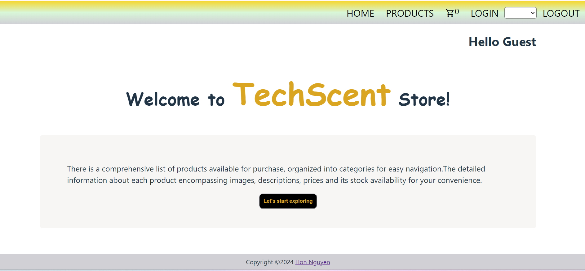

# React + e-commerce
## 1. Introduction
The website showcases 30 products which are fetched from a public API. 
## 2 User stories
- User can create an account and maintains their saved items even after the browser was closed
- User can pay online
- User can modify their personal profile on the website
- User can update their password in case the password was not recalled
## 2. Preview

## 3. Visit the webpage here
[e-commerce website](https://hon-nova.github.io/meta-course)
